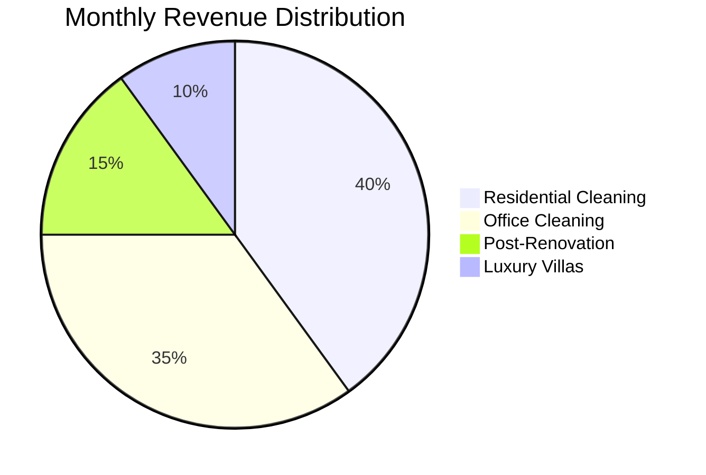
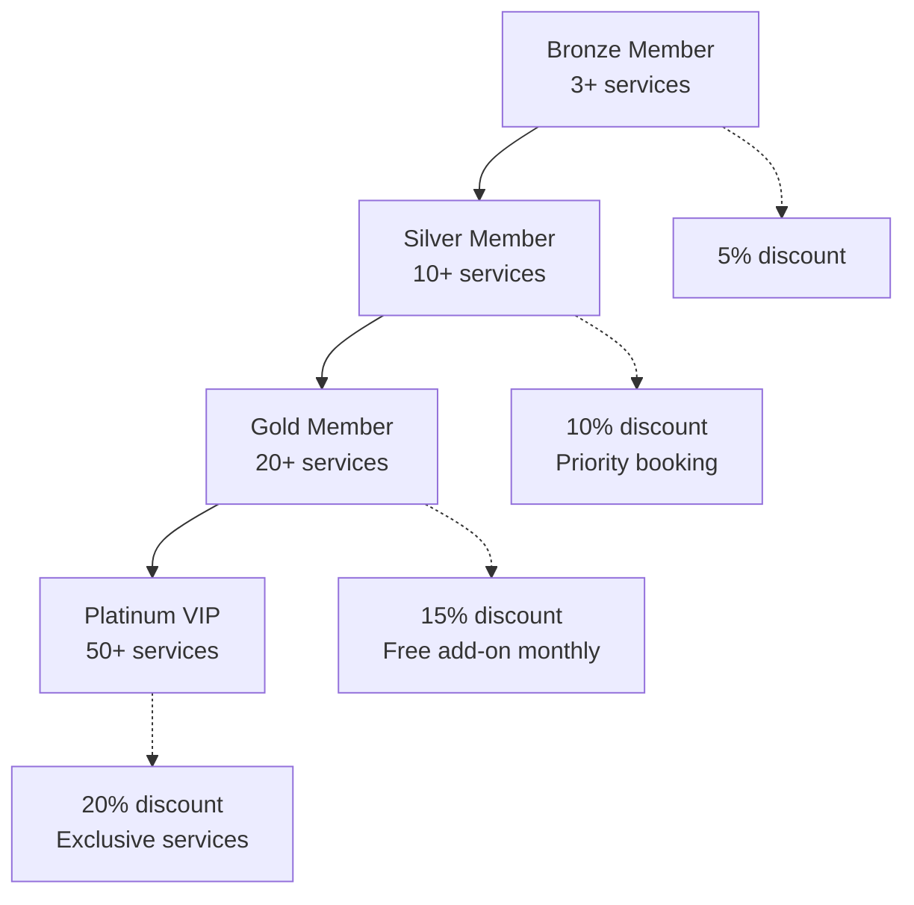
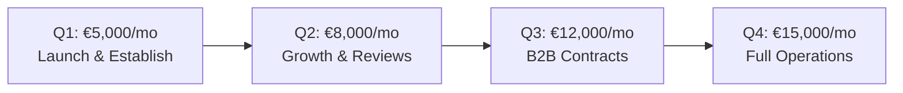

# LUNEX Cleaning Service - Business Revenue & Promotion Strategy

## Business Revenue Targets

### Realistic Revenue Projections for Cleaning Service



### Revenue Model
- **Average Residential Service**: €60-100 per visit
- **Office Cleaning Contract**: €200-500 per month
- **Post-Renovation Cleaning**: €150-300 per job
- **Luxury Villa Service**: €150-250 per visit
- **Monthly Revenue Target**: €3,000-10,000 (realistic for established business)

## Customer Acquisition Strategy

### 1. Launch Promotions

#### Grand Opening Campaign (Month 1-2)
```typescript
const launchPromotions = {
  firstTimeDeal: {
    name: "Welcome to LUNEX",
    discount: "30% off first cleaning",
    validFor: "60 days",
    targetAudience: "New customers only"
  },
  
  referralLaunch: {
    name: "Bring a Friend",
    offer: "Both get 20% off",
    duration: "First 3 months",
    stackable: false
  },
  
  socialMediaContest: {
    name: "Win Free Cleaning",
    prize: "3 months of free weekly cleaning",
    entry: "Follow + Share + Tag 3 friends",
    platform: ["Instagram", "Facebook"]
  }
}
```

#### Early Bird Specials
- **First 50 Customers**: Lifetime 10% discount
- **Opening Week**: Buy 2 services, get 1 free
- **Review Incentive**: Leave a review, get €10 off next service

### 2. Seasonal Promotions Calendar

```javascript
const seasonalPromotions = {
  spring: {
    name: "Spring Cleaning Special",
    months: ["March", "April"],
    offer: "Deep clean + Windows at regular price",
    savings: "€40 value"
  },
  
  summer: {
    name: "Vacation Home Prep",
    months: ["June", "July"],
    offer: "Pre/Post vacation cleaning package",
    discount: "15% off"
  },
  
  autumn: {
    name: "Back to School/Work",
    months: ["September", "October"],
    offer: "Office cleaning first month free",
    target: "B2B clients"
  },
  
  winter: {
    name: "Holiday Hosting Ready",
    months: ["November", "December"],
    offer: "Party prep & cleanup service",
    bundle: "Save €50 on combo"
  }
}
```

### 3. Service Packages & Pricing

#### Residential Packages
```typescript
const residentialPackages = {
  basic: {
    name: "Essential Clean",
    duration: "2 hours",
    price: 60,
    includes: ["Living areas", "Kitchen", "Bathroom", "Floors"]
  },
  
  standard: {
    name: "Complete Home",
    duration: "3-4 hours",
    price: 90,
    includes: ["All basic", "Bedrooms", "Windows inside", "Detailed dusting"]
  },
  
  premium: {
    name: "Deep Clean Deluxe",
    duration: "4-6 hours",
    price: 150,
    includes: ["Everything", "Appliances inside", "Baseboards", "Light fixtures"]
  }
}
```

#### Commercial Packages
```typescript
const commercialPackages = {
  small_office: {
    name: "Small Office (up to 100m²)",
    frequency: "Daily/Weekly",
    monthlyPrice: 300,
    includes: ["Workspace cleaning", "Bathrooms", "Kitchen", "Trash removal"]
  },
  
  medium_office: {
    name: "Medium Office (100-300m²)",
    frequency: "Daily/Weekly",
    monthlyPrice: 600,
    includes: ["All areas", "Meeting rooms", "Reception", "Supplies included"]
  },
  
  large_office: {
    name: "Corporate Space (300m²+)",
    frequency: "Custom schedule",
    monthlyPrice: "From €1000",
    includes: ["Full service", "Dedicated team", "Emergency cleaning"]
  }
}
```

### 4. Customer Loyalty Programs

#### Membership Tiers


#### Loyalty Benefits
- **Points System**: €1 spent = 1 point
- **Rewards**: 100 points = €10 discount
- **Birthday Special**: Free add-on service
- **Anniversary Bonus**: Double points month

### 5. Digital Marketing Campaigns

#### Google Ads Strategy
```typescript
const googleAdsStrategy = {
  monthlyBudget: 300, // €
  campaigns: [
    {
      type: "Search",
      keywords: [
        "pulizie Romano di Lombardia",
        "impresa pulizie Bergamo",
        "pulizie uffici vicino a me",
        "servizio pulizie professionale"
      ],
      budgetAllocation: "60%"
    },
    {
      type: "Display",
      targeting: "Remarketing + Similar audiences",
      budgetAllocation: "25%"
    },
    {
      type: "Local Services",
      radius: "20km",
      budgetAllocation: "15%"
    }
  ],
  expectedROI: "4:1" // €4 revenue per €1 spent
}
```

#### Social Media Advertising
```yaml
Facebook/Instagram:
  Budget: €200/month
  Campaigns:
    - Awareness: Local area targeting
    - Conversion: Website visitors retargeting
    - Engagement: Content boosting
  
  Content Calendar:
    Monday: Cleaning tips
    Wednesday: Before/After photos
    Friday: Team spotlights
    Sunday: Customer testimonials
```

### 6. Partnership & B2B Strategy

#### Strategic Partnerships
```typescript
const b2bPartnerships = [
  {
    partner: "Real Estate Agencies",
    opportunity: "End-of-lease cleaning",
    commission: "10% to agency",
    potential: "20-30 jobs/month"
  },
  {
    partner: "Property Management Companies",
    opportunity: "Regular maintenance contracts",
    value: "€500-2000/month per building",
    contracts: "3-5 buildings target"
  },
  {
    partner: "Construction Companies",
    opportunity: "Post-construction cleanup",
    value: "€300-1000 per project",
    frequency: "5-10 projects/month"
  },
  {
    partner: "Hotels & B&Bs",
    opportunity: "Overflow cleaning support",
    rate: "Premium pricing",
    potential: "€1000-3000/month"
  }
]
```

### 7. Revenue Growth Timeline

#### Year 1 Projections


#### Monthly Breakdown (First Year)
```
Month 1-2: €3,000-5,000 (Launch promotions, initial customers)
Month 3-4: €5,000-7,000 (Word of mouth, reviews building)
Month 5-6: €7,000-10,000 (B2B contracts starting)
Month 7-9: €10,000-13,000 (Established reputation)
Month 10-12: €13,000-18,000 (Holiday season + contracts)
```

### 8. Promotional Tactics

#### Online Promotions
1. **Flash Sales**: 24-hour deals announced on social media
2. **Bundle Deals**: Kitchen + Bathroom deep clean special
3. **Subscription Discounts**: Save 20% with monthly plans
4. **Group Deals**: Organize with neighbors for area discounts

#### Offline Promotions
1. **Flyer Distribution**: 5,000 flyers in target neighborhoods
2. **Local Events**: Sponsor community events
3. **Business Cards**: Leave at local businesses
4. **Vehicle Branding**: Company cars as mobile ads

#### Email Marketing
```typescript
const emailCampaigns = {
  welcome: {
    series: 3,
    offers: ["10% off", "Service guide", "Referral bonus"]
  },
  
  monthly: {
    content: ["Cleaning tips", "Special offers", "Customer spotlight"],
    frequency: "Twice monthly"
  },
  
  reactivation: {
    trigger: "No service for 60 days",
    offer: "We miss you - 25% off comeback"
  }
}
```

### 9. Competitive Pricing Strategy

#### Market Positioning
```
Budget Competitors: €40-50/service
LUNEX Pricing: €60-90/service  
Premium Competitors: €100-150/service

Value Proposition: Professional quality at fair prices
```

#### Dynamic Pricing
- **Peak Times**: +10% (weekends, holidays)
- **Off-Peak**: -15% (weekday mornings)
- **Last-Minute**: -20% (same-day availability)
- **Bulk Booking**: -10% (5+ services prepaid)

### 10. Performance Metrics

#### Key Performance Indicators
```typescript
const businessKPIs = {
  monthlyRevenue: {
    target: 10000, // €
    minimum: 5000, // €
  },
  
  customerMetrics: {
    newCustomersPerMonth: 30,
    retentionRate: 70, // %
    averageServiceValue: 85, // €
    servicesPerCustomer: 2.5 // monthly
  },
  
  operationalMetrics: {
    bookingConversion: 25, // %
    customerSatisfaction: 4.5, // out of 5
    employeeUtilization: 80, // %
    profitMargin: 35 // %
  }
}
```

### 11. Special Event Promotions

#### Holiday Specials
- **Christmas**: Gift certificates with 10% bonus value
- **Easter**: Spring cleaning marathon weekend
- **Summer**: Vacation prep packages
- **Back to School**: Kids' room special

#### Local Events
- **City Festival**: Booth with prize wheel
- **Business Expo**: B2B lead generation
- **Charity Events**: Donate services for publicity

### 12. Innovation & Differentiation

#### Unique Selling Points
1. **Eco-Friendly Option**: Green cleaning products
2. **Tech Integration**: Real-time tracking, digital receipts
3. **Satisfaction Guarantee**: Re-clean if not satisfied
4. **Flexible Scheduling**: Evening and weekend availability
5. **Insured & Bonded**: Full protection for clients

#### Future Services
- **Organizing Services**: Partner with professional organizers
- **Laundry Service**: Add-on for busy professionals
- **Pet-Friendly Cleaning**: Specialized for pet owners
- **Elderly Care Cleaning**: Gentle service for seniors

## Implementation Roadmap

### Immediate Actions (Week 1)
1. Set up business operations
2. Hire and train initial staff
3. Launch promotional materials
4. Activate online presence

### Month 1
1. Grand opening promotion
2. Distribute 5,000 flyers
3. Launch Google Ads
4. Partner outreach

### Month 2-3
1. Refine services based on feedback
2. Build review base
3. Establish B2B contracts
4. Scale operations

### Month 4-6
1. Expand service area
2. Add specialized services
3. Hire additional staff
4. Increase marketing budget

## Conclusion

This revenue strategy positions LUNEX to achieve €5,000-15,000 monthly revenue within the first year through:
- Aggressive launch promotions
- Strategic B2B partnerships
- Comprehensive digital marketing
- Exceptional service quality
- Customer loyalty programs

The key to success is consistent service delivery, active marketing, and building a strong local reputation through reviews and word-of-mouth recommendations.