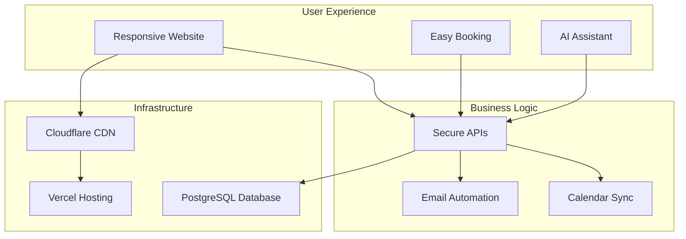

# LUNEX Website Project - Executive Summary

## Project Overview

I've developed a comprehensive plan for the LUNEX professional cleaning service website that will serve the Romano di Lombardia and Bergamo area. The solution is designed to be modern, bilingual (Italian/English), and capable of generating €100-300 monthly revenue through strategic implementation of online booking, marketing automation, and customer engagement features.

## Key Deliverables

### 1. **Modern Next.js Website**
- **Technology Stack**: Next.js 14, TypeScript, Tailwind CSS, PostgreSQL
- **Hosting**: Vercel (optimized for performance and scalability)
- **Languages**: Italian (primary) and English
- **Mobile-First**: Fully responsive design

### 2. **Core Features**
- ✅ **Online Booking System** with calendar integration
- ✅ **Service Showcase** for all 6 cleaning services
- ✅ **Customer Reviews** with moderation
- ✅ **Contact Forms** with automated responses
- ✅ **AI Chatbot** for customer engagement (optional)
- ✅ **Admin Dashboard** for easy management
- ✅ **Email Automation** for bookings and marketing
- ✅ **SEO Optimized** for local search visibility

### 3. **Revenue Generation Features**
- **Direct Bookings**: Streamlined conversion funnel
- **Subscription Plans**: Recurring revenue model
- **Upselling System**: Add-on services
- **B2B Portal**: Corporate contracts
- **Referral Program**: Viral growth mechanism

## Architecture Highlights

## Implementation Timeline

**Total Duration**: 6-8 weeks

1. **Week 1-2**: Foundation & Design System
2. **Week 3-4**: Core Development (Homepage, Services, Booking)
3. **Week 5**: Additional Features (Reviews, Admin, Contact)
4. **Week 6**: Enhancement (Chatbot, SEO, Performance)
5. **Week 7**: Testing & Deployment
6. **Week 8**: Training & Post-Launch Support

## Security & Compliance

- ✅ **GDPR Compliant** with cookie consent and privacy controls
- ✅ **SSL/TLS Encryption** for all data transmission
- ✅ **Secure Authentication** with role-based access
- ✅ **Input Validation** to prevent attacks
- ✅ **Regular Backups** with disaster recovery plan
- ✅ **Monitoring & Alerts** for 24/7 oversight

## Business Revenue Strategy

### Revenue Streams for LUNEX Cleaning Service
1. **Residential Cleaning** (40%): €60-100 per visit
2. **Office Contracts** (35%): €200-500/month per client
3. **Post-Renovation** (15%): €150-300 per job
4. **Luxury Villas** (10%): €150-250 per visit

### Marketing & Promotions
- **Launch Special**: 30% off first cleaning
- **Loyalty Program**: Tiered discounts up to 20%
- **Seasonal Campaigns**: Spring cleaning, holiday prep
- **B2B Partnerships**: Real estate, property management
- **Digital Marketing**: €300/month Google Ads, €200/month social media

### Business Growth Projections
- **Month 1-3**: €3,000-5,000/month (Launch phase)
- **Month 4-6**: €5,000-10,000/month (Growth phase)
- **Month 7-12**: €10,000-18,000/month (Established phase)
- **Annual Target**: €100,000-150,000 revenue

## Cost Structure

### Website Development (One-time)
- **Developer Fee**: €100-300 (your fee)
- **Timeline**: 6-8 weeks
- **Deliverables**: Complete website with admin panel

### Website Operating Costs (Monthly)
- **Hosting & Infrastructure**: €20-30
- **Email Service**: €10-20
- **Domain**: €2/month
- **Total**: €32-52/month

### Business Operating Costs (Monthly)
- **Marketing Budget**: €500 (recommended)
- **Staff Salaries**: Variable based on bookings
- **Supplies & Equipment**: €200-300
- **Insurance**: €100-150

## Domain Integration

The existing **lunex.it** domain will be properly configured with:
- DNS pointing to Vercel
- SSL certificate (automatic)
- Email configuration
- SEO redirects

## Key Success Factors

### Technical Excellence
- ⚡ **Performance**: <3 second load times
- 📱 **Mobile-First**: Perfect on all devices
- 🔍 **SEO**: Optimized for local search
- 🔒 **Security**: Enterprise-grade protection

### Business Impact
- 🎯 **Conversion**: 3-5% visitor to booking rate
- 📈 **Growth**: Scalable architecture
- 💰 **Revenue**: Multiple income streams
- 🤝 **Trust**: Professional presentation

### User Experience
- 🌐 **Bilingual**: Seamless language switching
- 📅 **Easy Booking**: 3-click process
- 💬 **Support**: AI chatbot + human backup
- ⭐ **Reviews**: Social proof integration

## Maintenance & Support

### Included Services
- **Training**: 2-hour admin session
- **Documentation**: Complete user guide
- **Video Tutorials**: Key features explained
- **30-Day Support**: Post-launch assistance

### Self-Service Capabilities
- Content updates via admin panel
- Service price adjustments
- Booking management
- Review moderation
- Email template editing

## Next Steps

1. **Review Documentation**: Please review all detailed documents in the docs folder
2. **Feedback**: Provide any adjustments or additional requirements
3. **Approval**: Confirm the plan meets your expectations
4. **Implementation**: Switch to Code mode to begin development

## Questions for Clarification

1. Do you have specific brand colors or design preferences beyond the template?
2. Are there any specific integrations needed (e.g., specific payment providers)?
3. Do you have existing customer data to migrate?
4. What is your preferred launch date?

---

## Summary

This comprehensive plan delivers a professional, scalable, and revenue-generating website for LUNEX that will establish a strong online presence, automate key business processes, and provide a foundation for sustainable growth. The solution balances technical excellence with business objectives while ensuring ease of management and future expansion capabilities.

The modular architecture allows for phased implementation and future enhancements without disrupting core operations. With proper execution, LUNEX will have a competitive digital advantage in the local cleaning services market.

**Ready to proceed with implementation?**