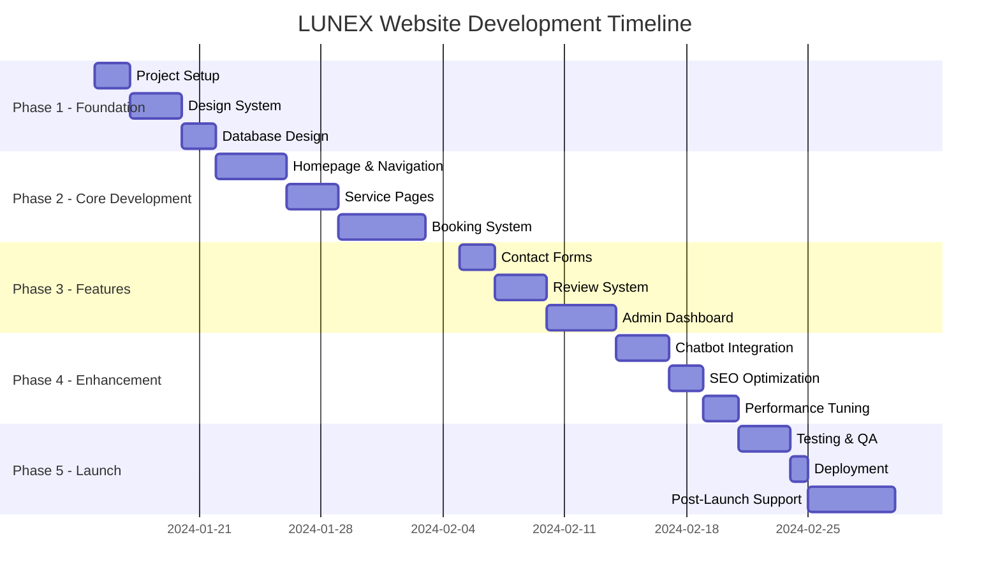
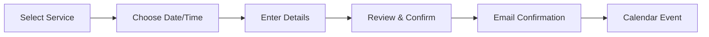

# LUNEX Website - Implementation Plan

## Project Timeline Overview



## Phase 1: Foundation (5 days)

### 1.1 Project Setup (2 days)
```bash
# Initialize Next.js project with TypeScript
npx create-next-app@latest lunex-website --typescript --tailwind --app

# Install core dependencies
npm install @prisma/client prisma
npm install next-intl react-hook-form zod
npm install @radix-ui/react-dialog @radix-ui/react-select
npm install lucide-react framer-motion
npm install resend @vercel/analytics
```

**Tasks:**
- [ ] Initialize Git repository
- [ ] Setup project structure
- [ ] Configure TypeScript
- [ ] Setup ESLint and Prettier
- [ ] Configure environment variables
- [ ] Setup development database

### 1.2 Design System (3 days)
**Components to create:**
```typescript
// Core UI Components
- Button (primary, secondary, outline)
- Input fields (text, email, phone, textarea)
- Select dropdowns
- Date/Time pickers
- Cards
- Modals
- Navigation menu
- Footer
- Loading states
- Error states
```

**Color Palette:**
```css
:root {
  --primary: #1e40af;      /* Professional Blue */
  --secondary: #10b981;    /* Success Green */
  --accent: #f59e0b;       /* Gold/Orange */
  --background: #ffffff;
  --foreground: #0f172a;
  --muted: #f1f5f9;
  --border: #e2e8f0;
}
```

### 1.3 Database Design (2 days)
- [ ] Setup Prisma schema
- [ ] Create migrations
- [ ] Seed initial data
- [ ] Setup database connection
- [ ] Configure Prisma Client

## Phase 2: Core Development (12 days)

### 2.1 Homepage & Navigation (4 days)

**Homepage Sections:**
```typescript
// Component Structure
<HomePage>
  <HeroSection />           // Banner with CTA
  <ServicesOverview />      // 6 service cards
  <WhyChooseUs />          // Trust indicators
  <TestimonialsCarousel /> // Customer reviews
  <CTASection />           // Booking prompt
</HomePage>
```

**Navigation Features:**
- Responsive mobile menu
- Language switcher (IT/EN)
- Sticky header on scroll
- Active page highlighting

### 2.2 Service Pages (3 days)

**Individual Service Page Template:**
```typescript
interface ServicePageProps {
  service: {
    name: string
    description: string
    features: string[]
    pricing?: PricingTier[]
    gallery: Image[]
  }
}
```

**Pages to create:**
1. Office Cleaning
2. Domestic Cleaning
3. Post-Renovation
4. Luxury Villas
5. Deep Cleaning
6. Maintenance Cleaning

### 2.3 Booking System (5 days)

**Booking Flow:**


**Implementation Tasks:**
- [ ] Service selection component
- [ ] Calendar with availability
- [ ] Time slot picker
- [ ] Customer form with validation
- [ ] Booking confirmation page
- [ ] Email notifications
- [ ] Admin booking management

## Phase 3: Additional Features (9 days)

### 3.1 Contact Forms (2 days)
- [ ] General contact form
- [ ] Quick quote request
- [ ] Callback request
- [ ] Form validation
- [ ] Email notifications
- [ ] Thank you pages

### 3.2 Review System (3 days)
- [ ] Review submission form
- [ ] Star rating component
- [ ] Review display grid
- [ ] Moderation interface
- [ ] Review statistics
- [ ] Schema.org markup

### 3.3 Admin Dashboard (4 days)

**Dashboard Features:**
```typescript
// Admin Routes
/admin/dashboard      // Overview stats
/admin/bookings      // Manage bookings
/admin/services      // Edit services
/admin/reviews       // Moderate reviews
/admin/contacts      // View inquiries
/admin/settings      // Site settings
```

**Implementation:**
- [ ] Authentication system
- [ ] Role-based access
- [ ] CRUD operations
- [ ] Data visualization
- [ ] Export functionality

## Phase 4: Enhancement (7 days)

### 4.1 Chatbot Integration (3 days)

**Chatbot Features:**
```javascript
const chatbotIntents = {
  greeting: ["hello", "hi", "ciao"],
  services: ["services", "servizi", "cleaning"],
  booking: ["book", "appointment", "prenota"],
  pricing: ["price", "cost", "prezzo"],
  contact: ["contact", "phone", "email"]
}
```

**Implementation:**
- [ ] Chat widget UI
- [ ] Intent recognition
- [ ] Response templates
- [ ] Booking integration
- [ ] Fallback to human

### 4.2 SEO Optimization (2 days)
- [ ] Meta tags for all pages
- [ ] OpenGraph tags
- [ ] Sitemap generation
- [ ] Robots.txt
- [ ] Schema.org markup
- [ ] Page speed optimization

### 4.3 Performance Tuning (2 days)
- [ ] Image optimization
- [ ] Code splitting
- [ ] Lazy loading
- [ ] Cache headers
- [ ] Bundle analysis
- [ ] Performance monitoring

## Phase 5: Launch (10 days)

### 5.1 Testing & QA (3 days)

**Testing Checklist:**
```typescript
// Unit Tests
- Component rendering
- Form validation
- API endpoints
- Database operations

// Integration Tests
- Booking flow
- Email sending
- Payment processing
- Multi-language

// E2E Tests
- User journeys
- Mobile responsiveness
- Cross-browser
- Performance
```

### 5.2 Deployment (1 day)

**Deployment Steps:**
1. Setup Vercel project
2. Configure environment variables
3. Connect GitHub repository
4. Setup custom domain (lunex.it)
5. Configure SSL
6. Setup monitoring
7. Deploy to production

### 5.3 Post-Launch Support (5 days)
- [ ] Monitor performance
- [ ] Fix any bugs
- [ ] Client training
- [ ] Documentation
- [ ] Handover process

## Development Standards

### Code Quality
```typescript
// TypeScript strict mode
{
  "compilerOptions": {
    "strict": true,
    "noImplicitAny": true,
    "strictNullChecks": true
  }
}
```

### Git Workflow
```bash
main
├── develop
│   ├── feature/homepage
│   ├── feature/booking-system
│   └── feature/admin-dashboard
└── hotfix/production-bugs
```

### Testing Strategy
- Unit tests: 80% coverage
- Integration tests: Critical paths
- E2E tests: Main user journeys
- Performance tests: < 3s load time
- Accessibility tests: WCAG 2.1 AA

## Resource Allocation

### Team Structure
```
Project Manager (10%)
├── Frontend Developer (100%)
├── Backend Developer (80%)
├── UI/UX Designer (20%)
└── QA Tester (20%)
```

### Budget Breakdown
```
Development: €3,000
├── Frontend Development: €1,500
├── Backend Development: €1,000
├── Design & UX: €300
└── Testing & QA: €200

Infrastructure (Annual): €600
├── Hosting (Vercel): €240
├── Database (Supabase): €0
├── Email Service: €120
├── Domain & SSL: €50
└── Monitoring: €190
```

## Risk Management

### Technical Risks
1. **Browser Compatibility**
   - Mitigation: Test on all major browsers
   - Fallback: Progressive enhancement

2. **Performance Issues**
   - Mitigation: Performance budget
   - Monitoring: Real-time alerts

3. **Security Vulnerabilities**
   - Mitigation: Security audit
   - Updates: Dependency scanning

### Business Risks
1. **Scope Creep**
   - Mitigation: Clear requirements
   - Control: Change request process

2. **Timeline Delays**
   - Mitigation: Buffer time
   - Communication: Regular updates

## Success Criteria

### Technical Metrics
- Page Speed Score: > 90
- Accessibility Score: > 95
- SEO Score: > 90
- Mobile Usability: 100%

### Business Metrics
- Booking Conversion: > 3%
- Contact Form Submissions: > 20/month
- Page Views: > 1000/month
- Bounce Rate: < 50%

## Maintenance Plan

### Regular Tasks
- Weekly: Backup verification
- Monthly: Security updates
- Quarterly: Performance review
- Yearly: Major updates

### Support SLA
- Critical Issues: 4 hours
- Major Issues: 24 hours
- Minor Issues: 72 hours
- Feature Requests: Next sprint

## Deliverables

1. **Source Code**
   - GitHub repository
   - Documentation
   - Deployment guide

2. **Admin Access**
   - CMS credentials
   - Analytics access
   - Email service access

3. **Documentation**
   - User manual
   - Admin guide
   - API documentation

4. **Training**
   - 2-hour admin training
   - Video tutorials
   - FAQ document