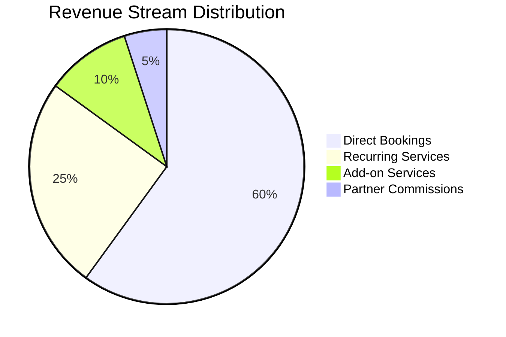
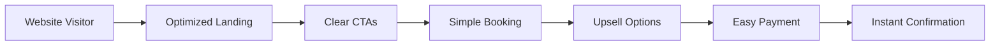
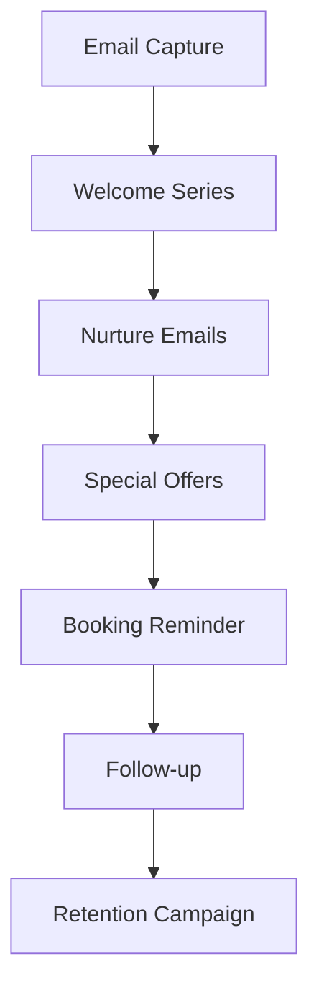
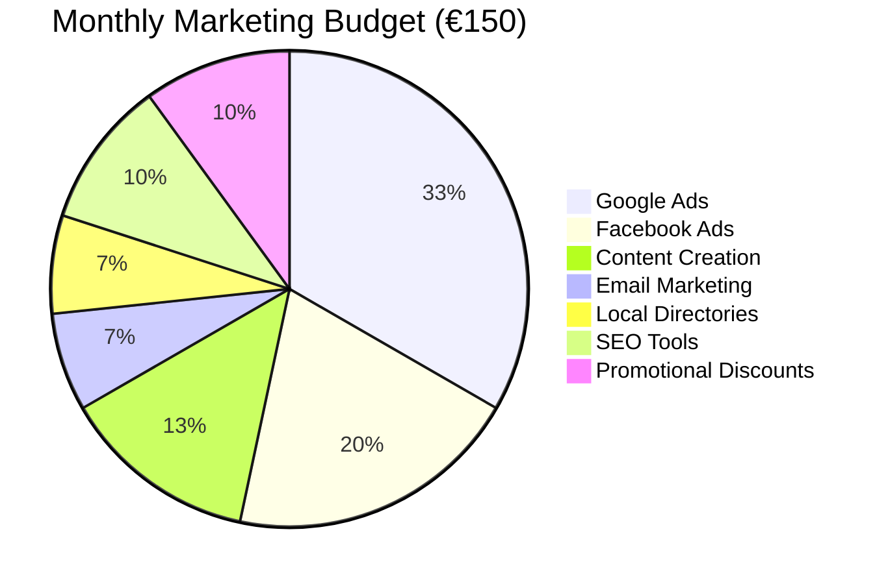

# LUNEX Website - Monetization & Revenue Generation Strategy

## Revenue Target Analysis

### Target: €100-300 Monthly Revenue



### Revenue Calculation Model
- **Average Service Value**: €50-80 per booking
- **Target Bookings**: 3-5 per month minimum
- **Conversion Rate Goal**: 3-5% of website visitors
- **Monthly Visitors Needed**: 100-200 qualified leads

## Core Monetization Strategies

### 1. Direct Service Booking Optimization

#### 1.1 Pricing Strategy
```typescript
interface PricingTier {
  basic: {
    name: "Essential Clean"
    price: 50
    features: ["2-hour service", "Basic cleaning", "Standard products"]
  }
  standard: {
    name: "Complete Clean"
    price: 80
    features: ["3-hour service", "Deep cleaning", "Eco products", "Windows"]
  }
  premium: {
    name: "Luxury Service"
    price: 120
    features: ["4+ hour service", "Premium products", "Extra services", "Priority booking"]
  }
}
```

#### 1.2 Conversion Optimization


**Implementation Features:**
- Prominent "Book Now" buttons (above fold)
- Price calculator widget
- Limited-time offers
- Social proof (reviews/testimonials)
- Urgency indicators ("Only 2 slots left this week")
- Exit-intent popups with discounts

### 2. Recurring Revenue Models

#### 2.1 Subscription Plans
```typescript
const subscriptionPlans = {
  weekly: {
    name: "Weekly Maintenance",
    discount: 15,
    commitment: 3, // months
    value: 170 // €/month
  },
  biweekly: {
    name: "Bi-Weekly Care",
    discount: 10,
    commitment: 3,
    value: 100 // €/month
  },
  monthly: {
    name: "Monthly Refresh",
    discount: 5,
    commitment: 6,
    value: 55 // €/month
  }
}
```

#### 2.2 Customer Retention Program
- **Loyalty Points**: 1 point per €10 spent
- **Rewards**: Free service after 10 bookings
- **Referral Bonus**: 20% off for successful referrals
- **Birthday Discounts**: 25% off during birthday month

### 3. Upselling & Cross-selling

#### 3.1 Add-on Services
```javascript
const addOnServices = [
  { name: "Window Cleaning", price: 20 },
  { name: "Oven Deep Clean", price: 25 },
  { name: "Carpet Shampooing", price: 30 },
  { name: "Organizing Service", price: 35 },
  { name: "Eco Products Upgrade", price: 10 },
  { name: "Same-Day Service", price: 15 }
]
```

#### 3.2 Bundle Packages
```typescript
const bundles = {
  moveIn: {
    name: "Move-In Special",
    services: ["Deep Clean", "Window Cleaning", "Carpet Clean"],
    price: 150, // vs 175 separately
    savings: 25
  },
  seasonal: {
    name: "Spring Cleaning",
    services: ["Deep Clean", "Organizing", "Windows"],
    price: 130,
    savings: 20
  }
}
```

### 4. Lead Generation & Conversion

#### 4.1 Lead Magnets
- **Free Cleaning Checklist** (PDF download)
- **"10 Cleaning Hacks" Guide** (email capture)
- **Home Cleaning Calculator** (interactive tool)
- **First-Time Customer Discount** (15% off)

#### 4.2 Email Marketing Funnel


### 5. SEO & Content Marketing

#### 5.1 Target Keywords
```yaml
Primary Keywords:
  - "pulizie Romano di Lombardia" (High intent, local)
  - "impresa pulizie Bergamo" (Commercial intent)
  - "pulizie uffici Lombardia" (B2B focus)
  
Long-tail Keywords:
  - "pulizie post ristrutturazione Romano"
  - "servizio pulizie ville di lusso Bergamo"
  - "pulizie domestiche prezzi Lombardia"
```

#### 5.2 Content Strategy
- **Service Pages**: Detailed, keyword-optimized
- **Blog Posts**: "How to" guides, cleaning tips
- **Local Pages**: Area-specific service pages
- **Case Studies**: Before/after showcases

### 6. Paid Advertising Strategy

#### 6.1 Google Ads Campaign
```typescript
const googleAdsCampaign = {
  budget: 50, // €/month
  targeting: {
    locations: ["Romano di Lombardia", "Bergamo", "Treviglio"],
    radius: "15km",
    languages: ["Italian", "English"]
  },
  keywords: [
    { keyword: "pulizie urgenti", bid: 1.50 },
    { keyword: "impresa pulizie", bid: 1.20 },
    { keyword: "pulizie uffici", bid: 1.80 }
  ],
  expectedROI: 3.5 // €3.50 return per €1 spent
}
```

#### 6.2 Facebook/Instagram Ads
- **Retargeting**: Website visitors who didn't book
- **Lookalike Audiences**: Based on existing customers
- **Local Awareness**: Geographic targeting
- **Budget**: €30/month
- **Expected CTR**: 2-3%

### 7. Partnership & B2B Strategy

#### 7.1 Strategic Partnerships
```typescript
const partnerships = [
  {
    type: "Real Estate Agencies",
    commission: 10,
    services: ["Move-out cleaning", "Property preparation"]
  },
  {
    type: "Property Management",
    commission: 15,
    services: ["Regular maintenance", "Emergency cleaning"]
  },
  {
    type: "Construction Companies",
    commission: 8,
    services: ["Post-renovation cleaning"]
  },
  {
    type: "Office Buildings",
    commission: 0, // Direct contracts
    services: ["Daily/weekly office cleaning"]
  }
]
```

#### 7.2 B2B Lead Generation
- **LinkedIn Outreach**: Target local businesses
- **Cold Email Campaign**: Personalized offers
- **Networking Events**: Local business associations
- **Corporate Packages**: Volume discounts

### 8. Pricing Psychology

#### 8.1 Psychological Pricing Tactics
```javascript
const pricingTactics = {
  charm: 49.99, // vs 50
  prestige: 100, // Round numbers for premium
  bundle: "Save €25", // Focus on savings
  anchor: "Usually €80", // Show value
  urgency: "Book today for 10% off"
}
```

#### 8.2 Dynamic Pricing
- **Off-Peak Discounts**: 15% off weekday mornings
- **Last-Minute Deals**: Fill cancelled slots
- **Seasonal Pricing**: Higher during spring cleaning
- **First-Time Offers**: Acquisition focused

### 9. Revenue Tracking & Analytics

#### 9.1 Key Performance Indicators
```typescript
interface RevenueKPIs {
  monthlyRevenue: number
  averageOrderValue: number
  conversionRate: number
  customerLifetimeValue: number
  customerAcquisitionCost: number
  monthlyRecurringRevenue: number
}

// Target KPIs
const targetKPIs: RevenueKPIs = {
  monthlyRevenue: 200, // €
  averageOrderValue: 65, // €
  conversionRate: 4, // %
  customerLifetimeValue: 300, // €
  customerAcquisitionCost: 20, // €
  monthlyRecurringRevenue: 100 // €
}
```

#### 9.2 Analytics Implementation
```javascript
// Google Analytics 4 Events
const trackingEvents = [
  "page_view",
  "service_view",
  "booking_started",
  "booking_completed",
  "add_to_cart", // Add-on services
  "purchase",
  "sign_up", // Newsletter
  "generate_lead" // Contact form
]

// Enhanced Ecommerce Tracking
window.gtag('event', 'purchase', {
  transaction_id: booking.id,
  value: booking.total,
  currency: 'EUR',
  items: booking.services
})
```

### 10. Growth Hacking Tactics

#### 10.1 Viral Features
- **Before/After Gallery**: Shareable content
- **Cleaning Tips Videos**: Social media content
- **Referral Contest**: Monthly prize draw
- **Customer Stories**: User-generated content

#### 10.2 Local SEO Domination
```yaml
Google My Business:
  - Complete profile with photos
  - Regular posts and updates
  - Respond to all reviews
  - Q&A section management
  - Service area settings
  - Booking button integration

Local Directories:
  - Yelp listing
  - Local Italian directories
  - Industry-specific portals
  - Chamber of Commerce listing
```

## Revenue Projection Model

### Month 1-3: Foundation Phase
```
- Monthly Revenue: €100-150
- Focus: SEO, initial customers, reviews
- Investment: €50/month ads
- Bookings: 2-3/month
```

### Month 4-6: Growth Phase
```
- Monthly Revenue: €150-250
- Focus: Paid ads, partnerships, upselling
- Investment: €80/month marketing
- Bookings: 3-5/month
- Recurring customers: 2
```

### Month 7-12: Scale Phase
```
- Monthly Revenue: €250-400
- Focus: Automation, B2B contracts, retention
- Investment: €100/month marketing
- Bookings: 5-8/month
- Recurring revenue: 40%
```

## Implementation Roadmap

### Immediate Actions (Week 1)
1. **Setup Analytics**: GA4, Facebook Pixel, Conversion tracking
2. **Create Lead Magnets**: Cleaning guide, calculator
3. **Launch Google My Business**: Complete optimization
4. **Initial Pricing**: Set competitive launch prices

### Short-term (Month 1)
1. **SEO Optimization**: All pages, local keywords
2. **Email Automation**: Welcome series, booking reminders
3. **First Promotion**: 20% off first booking
4. **Review Campaign**: Incentivize early reviews

### Medium-term (Month 2-3)
1. **Paid Ads Launch**: Google Ads, Facebook campaigns
2. **Partnership Outreach**: Real estate, property managers
3. **Content Marketing**: Weekly blog posts
4. **Upsell Implementation**: Add-on services

### Long-term (Month 4+)
1. **B2B Contracts**: Office buildings, companies
2. **Subscription Plans**: Recurring revenue focus
3. **Referral Program**: Viral growth
4. **Market Expansion**: Neighboring cities

## Budget Allocation



## Success Metrics & Monitoring

### Weekly Reviews
- Website traffic and sources
- Conversion rates by channel
- Booking values and frequency
- Customer feedback scores

### Monthly Analysis
- Revenue vs. target
- Customer acquisition cost
- Lifetime value trends
- ROI by marketing channel

### Quarterly Planning
- Strategy adjustments
- Budget reallocation
- Service expansion
- Market analysis

## Risk Mitigation

1. **Low Initial Traffic**: Increase local SEO efforts
2. **Poor Conversion**: A/B test landing pages
3. **High CAC**: Focus on retention and referrals
4. **Seasonal Dips**: Promote specific services
5. **Competition**: Differentiate with quality and reviews

## Conclusion

This monetization strategy provides multiple revenue streams and a clear path to achieving €100-300 monthly revenue within 3-6 months. The key is consistent execution, tracking, and optimization based on data. The combination of direct bookings, recurring revenue, strategic partnerships, and effective marketing will ensure sustainable growth for LUNEX's online presence and business success.