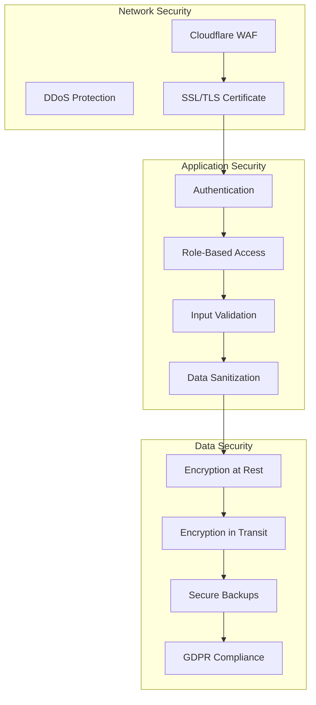
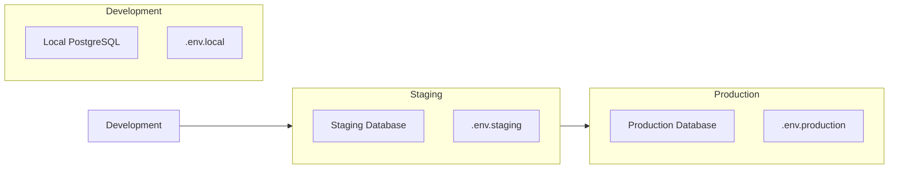
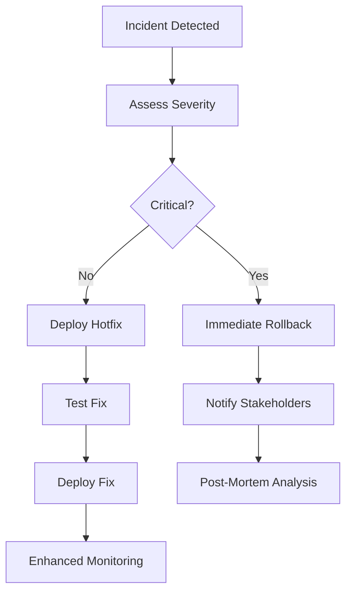

# LUNEX Website - Security & Deployment Strategy

## Security Architecture

### 1. Infrastructure Security



### 2. Security Measures Implementation

#### 2.1 Authentication & Authorization
```typescript
// NextAuth.js Configuration
export const authOptions: NextAuthOptions = {
  providers: [
    CredentialsProvider({
      name: 'credentials',
      credentials: {
        email: { label: "Email", type: "email" },
        password: { label: "Password", type: "password" }
      },
      async authorize(credentials) {
        // Implement secure password hashing with bcrypt
        // Rate limiting on login attempts
        // Account lockout after failed attempts
      }
    })
  ],
  session: {
    strategy: 'jwt',
    maxAge: 30 * 24 * 60 * 60, // 30 days
  },
  callbacks: {
    async jwt({ token, user }) {
      // Add user role to JWT
      if (user) {
        token.role = user.role
      }
      return token
    }
  }
}
```

#### 2.2 Input Validation & Sanitization
```typescript
// Zod Schema Example for Booking Form
const bookingSchema = z.object({
  customerName: z.string()
    .min(2, "Name must be at least 2 characters")
    .max(100, "Name must be less than 100 characters")
    .regex(/^[a-zA-Z\s'-]+$/, "Invalid characters in name"),
  
  email: z.string()
    .email("Invalid email format")
    .toLowerCase(),
  
  phone: z.string()
    .regex(/^\+?[0-9\s-()]+$/, "Invalid phone number"),
  
  serviceId: z.string().cuid(),
  
  date: z.date()
    .min(new Date(), "Date must be in the future"),
  
  address: z.string()
    .min(10, "Please provide a complete address")
    .max(500, "Address too long"),
  
  notes: z.string()
    .max(1000, "Notes too long")
    .optional()
})

// SQL Injection Prevention (Prisma handles this automatically)
// XSS Prevention with DOMPurify for user-generated content
import DOMPurify from 'isomorphic-dompurify'

export function sanitizeHTML(dirty: string): string {
  return DOMPurify.sanitize(dirty, {
    ALLOWED_TAGS: ['b', 'i', 'em', 'strong', 'a', 'br'],
    ALLOWED_ATTR: ['href']
  })
}
```

#### 2.3 Security Headers
```typescript
// next.config.js Security Headers
const securityHeaders = [
  {
    key: 'X-DNS-Prefetch-Control',
    value: 'on'
  },
  {
    key: 'Strict-Transport-Security',
    value: 'max-age=63072000; includeSubDomains; preload'
  },
  {
    key: 'X-XSS-Protection',
    value: '1; mode=block'
  },
  {
    key: 'X-Frame-Options',
    value: 'SAMEORIGIN'
  },
  {
    key: 'X-Content-Type-Options',
    value: 'nosniff'
  },
  {
    key: 'Referrer-Policy',
    value: 'origin-when-cross-origin'
  },
  {
    key: 'Content-Security-Policy',
    value: ContentSecurityPolicy.replace(/\s{2,}/g, ' ').trim()
  }
]
```

### 3. GDPR Compliance

#### 3.1 Data Protection Measures
```typescript
// Privacy-focused implementation
interface PrivacySettings {
  cookieConsent: boolean
  analyticsEnabled: boolean
  marketingEnabled: boolean
  functionalEnabled: boolean
}

// Cookie Banner Component
export function CookieBanner() {
  return (
    <div className="cookie-banner">
      <p>We use cookies to improve your experience. By continuing, you agree to our use of cookies.</p>
      <button onClick={acceptAll}>Accept All</button>
      <button onClick={acceptNecessary}>Necessary Only</button>
      <Link href="/privacy">Privacy Policy</Link>
    </div>
  )
}
```

#### 3.2 Data Rights Implementation
- **Right to Access**: User data export functionality
- **Right to Rectification**: Profile editing capabilities
- **Right to Erasure**: Account deletion with data purge
- **Right to Portability**: JSON/CSV export options
- **Right to Object**: Marketing opt-out mechanisms

### 4. Security Monitoring

```yaml
# Monitoring Stack
Application Security:
  - Sentry: Real-time error tracking
  - GitHub Advanced Security: Dependency scanning
  - Snyk: Vulnerability detection
  
Infrastructure Monitoring:
  - Cloudflare Analytics: Traffic analysis
  - Vercel Analytics: Performance metrics
  - Custom Alerts: Suspicious activity detection
  
Incident Response:
  - Automated alerts for security events
  - Incident response playbook
  - Regular security audits
```

## Deployment Strategy

### 1. Environment Setup



### 2. CI/CD Pipeline

```yaml
# .github/workflows/deploy.yml
name: Deploy to Production

on:
  push:
    branches: [main]

jobs:
  test:
    runs-on: ubuntu-latest
    steps:
      - uses: actions/checkout@v3
      - uses: actions/setup-node@v3
        with:
          node-version: '20'
          
      - name: Install dependencies
        run: npm ci
        
      - name: Run tests
        run: npm test
        
      - name: Run linting
        run: npm run lint
        
      - name: Type checking
        run: npm run type-check
        
      - name: Build application
        run: npm run build

  deploy:
    needs: test
    runs-on: ubuntu-latest
    steps:
      - uses: actions/checkout@v3
      
      - name: Deploy to Vercel
        uses: amondnet/vercel-action@v20
        with:
          vercel-token: ${{ secrets.VERCEL_TOKEN }}
          vercel-org-id: ${{ secrets.VERCEL_ORG_ID }}
          vercel-project-id: ${{ secrets.VERCEL_PROJECT_ID }}
          vercel-args: '--prod'
```

### 3. Infrastructure as Code

```typescript
// vercel.json
{
  "framework": "nextjs",
  "buildCommand": "npm run build",
  "devCommand": "npm run dev",
  "installCommand": "npm install",
  "regions": ["fra1"], // Frankfurt for Italian users
  "functions": {
    "app/api/booking/create/route.ts": {
      "maxDuration": 30
    }
  },
  "env": {
    "DATABASE_URL": "@database-url",
    "NEXTAUTH_SECRET": "@nextauth-secret",
    "EMAIL_API_KEY": "@email-api-key"
  }
}
```

### 4. Domain Configuration

```dns
# DNS Records for lunex.it
Type    Name    Value                   TTL
A       @       76.76.21.21            Auto
AAAA    @       2606:4700:3030::...    Auto
CNAME   www     cname.vercel-dns.com   Auto
MX      @       mx1.forwardemail.net   Auto
TXT     @       "v=spf1 include:..."   Auto
```

### 5. Deployment Checklist

#### Pre-Deployment
- [ ] All tests passing
- [ ] Security audit completed
- [ ] Performance benchmarks met
- [ ] SEO checklist verified
- [ ] Accessibility audit passed
- [ ] Legal pages ready (Privacy, Terms)
- [ ] SSL certificate configured
- [ ] Environment variables set

#### Deployment Steps
1. **Database Migration**
   ```bash
   npx prisma migrate deploy
   npx prisma db seed
   ```

2. **Build Verification**
   ```bash
   npm run build
   npm run start
   ```

3. **Deploy to Staging**
   ```bash
   vercel --env=preview
   ```

4. **Production Deploy**
   ```bash
   vercel --prod
   ```

#### Post-Deployment
- [ ] Verify all pages load
- [ ] Test booking flow
- [ ] Check email notifications
- [ ] Monitor error rates
- [ ] Verify analytics
- [ ] Test on multiple devices
- [ ] Check performance metrics

### 6. Rollback Strategy

```typescript
// Automated rollback on error spike
if (errorRate > threshold) {
  await vercel.revertToPreviousDeployment()
  await notifyTeam('Deployment rolled back due to errors')
}
```

### 7. Monitoring & Alerts

```typescript
// Custom monitoring setup
export const monitors = {
  uptime: {
    url: 'https://www.lunex.it',
    interval: 5, // minutes
    alertThreshold: 2 // consecutive failures
  },
  
  performance: {
    metrics: ['FCP', 'LCP', 'CLS', 'FID'],
    threshold: {
      FCP: 1800, // ms
      LCP: 2500, // ms
      CLS: 0.1,
      FID: 100 // ms
    }
  },
  
  booking: {
    endpoint: '/api/health/booking',
    interval: 15, // minutes
    timeout: 5000 // ms
  }
}
```

## Backup & Disaster Recovery

### 1. Backup Strategy

```yaml
Database Backups:
  - Frequency: Daily automated backups
  - Retention: 30 days rolling
  - Location: Multiple regions
  - Testing: Monthly restore tests

Code Repository:
  - Primary: GitHub
  - Mirror: GitLab (automated sync)
  - Branches: Protected main branch

Static Assets:
  - Primary: Vercel CDN
  - Backup: AWS S3
  - Sync: Hourly
```

### 2. Disaster Recovery Plan



### 3. Recovery Time Objectives

| Component | RTO | RPO |
|-----------|-----|-----|
| Website | 5 minutes | 0 minutes |
| Database | 30 minutes | 1 hour |
| Bookings | 15 minutes | 0 minutes |
| Emails | 1 hour | N/A |

## Security Best Practices

### Development Phase
1. **Code Security**
   - Regular dependency updates
   - Security linting (ESLint security plugin)
   - Code reviews focusing on security
   - Secrets scanning in CI/CD

2. **Access Control**
   - Principle of least privilege
   - MFA for all admin accounts
   - API key rotation every 90 days
   - Regular access audits

### Production Phase
1. **Runtime Security**
   - Rate limiting on all endpoints
   - Request size limits
   - Timeout configurations
   - Error message sanitization

2. **Data Security**
   - Encrypted database connections
   - Secure session management
   - PII data minimization
   - Audit logging for sensitive operations

## Compliance Checklist

- [ ] GDPR compliance verified
- [ ] Cookie policy implemented
- [ ] Privacy policy updated
- [ ] Terms of service drafted
- [ ] Data processing agreements signed
- [ ] SSL certificate active
- [ ] Security headers configured
- [ ] Backup procedures tested
- [ ] Incident response plan documented
- [ ] Admin training completed