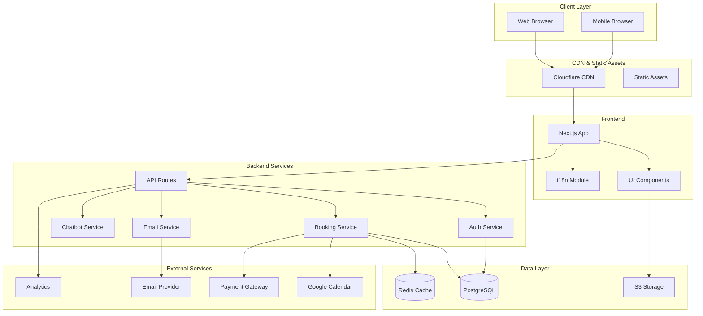
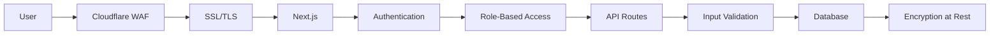
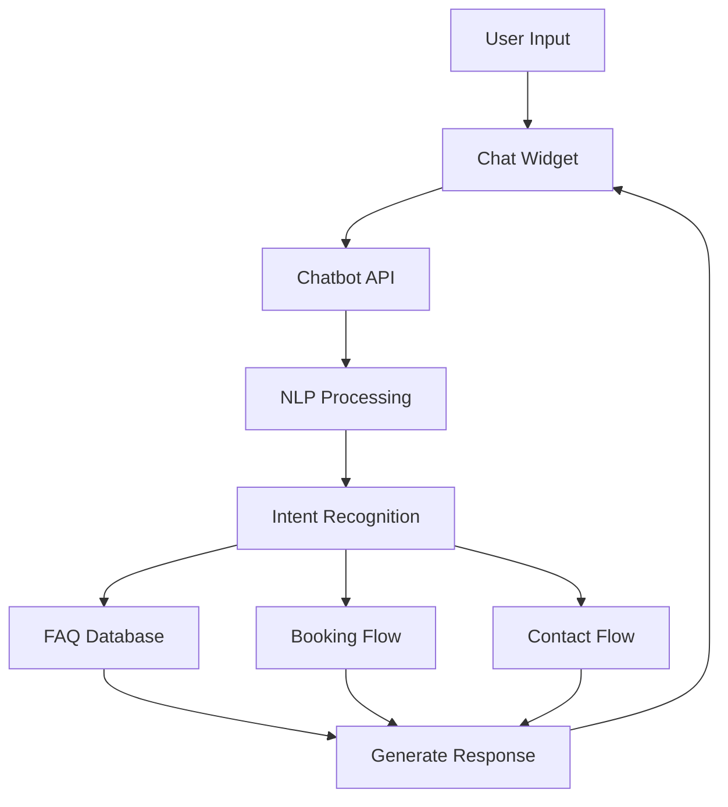
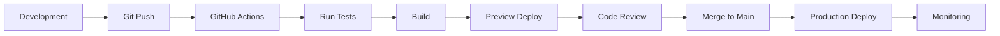

# LUNEX Website - Software Architecture

## Architecture Overview



## Technology Stack

### Frontend
- **Framework**: Next.js 14 (App Router)
- **Language**: TypeScript
- **Styling**: Tailwind CSS + Shadcn/ui
- **State Management**: Zustand
- **Forms**: React Hook Form + Zod
- **Animations**: Framer Motion
- **Icons**: Lucide React
- **Date Handling**: date-fns
- **Internationalization**: next-intl

### Backend
- **Runtime**: Node.js 20 LTS
- **API**: Next.js API Routes / tRPC
- **Database**: PostgreSQL with Prisma ORM
- **Caching**: Redis
- **Authentication**: NextAuth.js
- **Email**: Resend / SendGrid
- **File Storage**: AWS S3 / Cloudinary
- **Job Queue**: BullMQ

### DevOps & Deployment
- **Hosting**: Vercel (Next.js optimized)
- **Database**: Supabase / Neon
- **CDN**: Cloudflare
- **Monitoring**: Sentry
- **Analytics**: Google Analytics 4 + Plausible
- **CI/CD**: GitHub Actions
- **Container**: Docker (optional)

## System Architecture

### 1. Frontend Architecture

```typescript
// Folder Structure
src/
├── app/
│   ├── [locale]/
│   │   ├── (marketing)/
│   │   │   ├── page.tsx
│   │   │   ├── services/
│   │   │   ├── about/
│   │   │   └── contact/
│   │   ├── (booking)/
│   │   │   ├── book/
│   │   │   └── confirm/
│   │   └── (admin)/
│   │       ├── dashboard/
│   │       └── settings/
│   ├── api/
│   │   ├── booking/
│   │   ├── contact/
│   │   └── webhook/
│   └── layout.tsx
├── components/
│   ├── ui/
│   ├── booking/
│   ├── layout/
│   └── features/
├── lib/
│   ├── db/
│   ├── email/
│   └── utils/
├── hooks/
├── types/
└── i18n/
    ├── it/
    └── en/
```

### 2. Database Schema

```prisma
// Core Models
model Service {
  id          String   @id @default(cuid())
  name        Json     // Multilingual
  description Json     // Multilingual
  slug        String   @unique
  price       Decimal?
  duration    Int      // minutes
  isActive    Boolean  @default(true)
  bookings    Booking[]
  createdAt   DateTime @default(now())
  updatedAt   DateTime @updatedAt
}

model Booking {
  id            String   @id @default(cuid())
  customerName  String
  email         String
  phone         String
  service       Service  @relation(fields: [serviceId], references: [id])
  serviceId     String
  date          DateTime
  time          String
  address       String
  notes         String?
  status        BookingStatus @default(PENDING)
  totalAmount   Decimal?
  paymentStatus PaymentStatus @default(PENDING)
  createdAt     DateTime @default(now())
  updatedAt     DateTime @updatedAt
}

model Review {
  id          String   @id @default(cuid())
  name        String
  city        String
  rating      Int
  comment     String
  isApproved  Boolean  @default(false)
  createdAt   DateTime @default(now())
}

model Contact {
  id        String   @id @default(cuid())
  name      String
  email     String
  subject   String
  message   String
  status    ContactStatus @default(NEW)
  createdAt DateTime @default(now())
}

enum BookingStatus {
  PENDING
  CONFIRMED
  IN_PROGRESS
  COMPLETED
  CANCELLED
}

enum PaymentStatus {
  PENDING
  PAID
  FAILED
  REFUNDED
}

enum ContactStatus {
  NEW
  IN_PROGRESS
  RESOLVED
}
```

### 3. API Architecture

```typescript
// API Route Example: /api/booking/create
export async function POST(req: Request) {
  const body = await req.json()
  
  // Validate input
  const validated = bookingSchema.parse(body)
  
  // Create booking
  const booking = await prisma.booking.create({
    data: validated
  })
  
  // Send confirmation email
  await sendBookingConfirmation(booking)
  
  // Add to calendar
  await addToCalendar(booking)
  
  // Return response
  return NextResponse.json({ success: true, booking })
}
```

### 4. Security Architecture



**Security Measures:**
- SSL/TLS encryption (Let's Encrypt)
- OWASP security headers
- Rate limiting (100 requests/minute)
- Input validation and sanitization
- SQL injection prevention (Prisma)
- XSS protection
- CSRF tokens
- Environment variables for secrets
- Regular security audits

### 5. Performance Optimization

```typescript
// Performance Features
- Static Generation (SSG) for marketing pages
- Incremental Static Regeneration (ISR)
- Image optimization with next/image
- Font optimization
- Code splitting
- Lazy loading
- Redis caching for frequently accessed data
- Database connection pooling
- CDN for static assets
```

### 6. Chatbot Architecture



**Chatbot Features:**
- FAQ automation
- Service inquiries
- Booking assistance
- Lead qualification
- Multilingual support
- Fallback to human support

### 7. Integration Architecture

**Google Calendar Integration:**
```typescript
// Sync bookings with staff calendars
interface CalendarIntegration {
  createEvent(booking: Booking): Promise<CalendarEvent>
  updateEvent(bookingId: string, updates: Partial<Booking>): Promise<void>
  deleteEvent(bookingId: string): Promise<void>
  checkAvailability(date: Date, serviceId: string): Promise<TimeSlot[]>
}
```

**Email Service Integration:**
```typescript
// Email templates and automation
interface EmailService {
  sendBookingConfirmation(booking: Booking): Promise<void>
  sendBookingReminder(booking: Booking): Promise<void>
  sendContactReply(contact: Contact, reply: string): Promise<void>
  sendNewsletter(subscribers: Subscriber[]): Promise<void>
}
```

### 8. Monitoring & Analytics

```yaml
# Monitoring Stack
- Application Performance: Sentry
- Uptime Monitoring: UptimeRobot
- Analytics: Google Analytics 4 + Plausible
- Server Metrics: Vercel Analytics
- Error Tracking: LogRocket
- A/B Testing: Vercel Edge Config
```

## Scalability Considerations

1. **Horizontal Scaling**: Vercel automatically scales
2. **Database Scaling**: Connection pooling with Prisma
3. **Caching Strategy**: Redis for session and frequently accessed data
4. **CDN**: Cloudflare for global distribution
5. **Microservices Ready**: Can split into services as needed
6. **Multi-tenant Architecture**: Ready for multiple locations

## Development Workflow



## Cost Optimization

1. **Vercel**: Free tier for small projects, $20/month Pro
2. **Database**: Supabase free tier (500MB)
3. **Email**: Resend free tier (100 emails/day)
4. **CDN**: Cloudflare free tier
5. **Monitoring**: Free tiers available
6. **Total Estimated Cost**: €20-50/month

## Future Enhancements

1. **Mobile App**: React Native using same API
2. **IoT Integration**: Smart home cleaning schedules
3. **AI Features**: Predictive booking suggestions
4. **Franchise System**: Multi-location support
5. **Marketplace**: Connect with other service providers